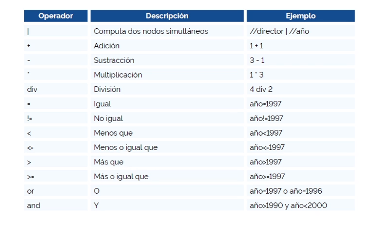

# XPath

Posee mas de 200 comandos predefinidos

En el siguiente enlace puedes probar el XML: [freeformater](https://www.freeformatter.com/xpath-tester.html)

XPath analiza el documento XML para crear arboles de noros de 7 tipos:

- Nodo raiz
- Elemento
- Texto
- Atributo
- Namespace
- Instruccion procesable
- Comentario

Usaremos este XML como ejemplo para el resto del tema.

```xml
<?xml version=”1.0” encoding=”UTF-8”?>
<Almacén>
<películas>
 <título lang=”es”>Harry Potter</título>
 <director>J K. Rowling</director>
 <año>2005</año>
 </películas>
<películas>
…
</películas>
…
</Almacén>
```

## Expresiones de ruta

- **Nombre_del_nodo** = Selecciona los nodos con el nombre especificado
- **/** = Selecciona el nodo raiz
- **//** = Selecciona los nodos que coinciden con el nodo actual
- **.** = Selecciona el nodo actual
- **..** = Selecciona el nodo padre del actual
- **@** = Selecciona atributos

Ejemplos

- **director** = Selecciona el nodo director
- **/Almacen** = Selecciona el nodo raiz
- **//titulo lang="es"** = Selecciona los nodos ``<<titulo lang="es">>``
- **//director | //año** = Selecciona los nodos "director" y "año"
- **@lang** = Selecciona el atributo ``lang``

Mas Ejemplos

Expresiones = Significado

- /Almacen/peliculas[1]/director = Se selecciona el director del nodo de peliculas O, en este caso James Cameron En ocasiones, dependiendo del navegador. los nodos se empiezan a contar desde el 0

- /Almacen/peliculas[last()]/director = El director de la última pelicula

- /Almacen/peticulas[last()-1]/director = El director de la penúltima pelicula

- //titulo[@lang='es'] = Solo los titulos de peliculas en españiol (atributo "es")

- /Almacen/peliculas[añio>1990]/director = Los directores de las peliculas del añio 1991 en
adelante.

- /Almacen/peliculas[position()<3]/director = Los directores de las dos primeras peliculas

## Operadores



## Comodines

Para seleccionar nodos desconocidos XPath cuenta con expresiones específicas llamadas comodines:

Comodín Descripción
``*`` = Selecciona cualquier nodo del elemento
``@*`` = Selecciona cualquier atributo del nodo
``node()`` = Selecciona cualquier nodo de cualquier clase

Ejemplos
``/películas/*`` = Selecciona todos los hijos de películas
``//*`` = Todos los elementos del documento
``//título[@*]`` = Selecciona el elemento título sin importar el atributo

